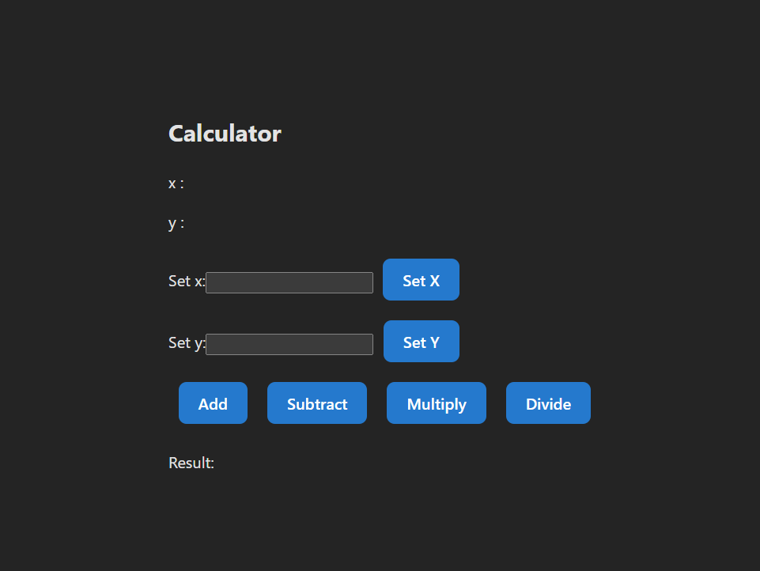

### Hardhat localhost was giving errror: Json- rpc error : 
it was working at starting but suddenly started giving error after some testing 

# Calculator Smart Contract Integration with React




###Deployment : sepolia test net using using remix ide


## Overview
This guide explains how to connect a Solidity smart contract (`Calculator`) to a React UI using ethers.js.

## Step 1: Install Dependencies
Install ethers.js in your React project:
```bash
npm install --save ethers
